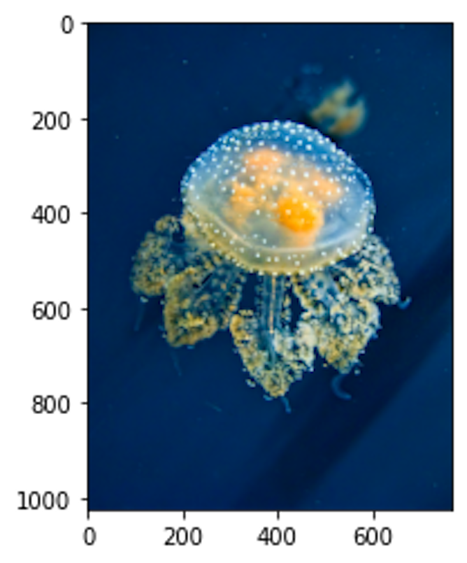

# RBF-Regression

## Introduction
This is an assignment of Introduction to Machine Learning at University of Toronto. The task is for students to complete RBF Regression method in order to impaint the corrupted picture. 
## Credit
This assignment was originally created by Prof. David Fleet and his TAs, B. Chan and S. wei. However, all the tasks were completed by myself.
### Requirements
This assignment requires matplotlib==3.1.2 or higher and numpy==1.18.0 or higher.
### Execution
```bash
python3 src/rbf_image_impainting.py
```
### Usage
In the rbf_image_impainting.py file, you may alter the hypter parameters - spacing, width, and l2_coef - in order to improve performance.
